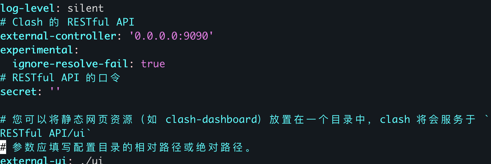

# Clash Web UI部署

参考文献：
> https://12520.net/archives/debian-mihomo-clash.mate-webui

以Arch为例进行部署，确保安装基本的gzip、git、vim等软件包。

## 1. 配置mihomo
Mihomo原名Clash Meta，是基于广受欢迎的开源网络代理工具Clash开发的增强网络代理工具。它不仅继承了Clash的核心功能，还增加了一些独特的特性，如支持更多的出站传输协议和复杂的规则控制等。在2023年经历了Clash for Windows删库事件之后，原Clash项目删库停止更新，于是开发者将Clash Meta改名为Mihomo，继续进行维护和更新。

先创建一个目录用于安装
```bash
cd /opt
sudo mkdir Clash
cd ./Clash
```

在github或者其他地方找到Linux-amd64版本的clashmeta下载，使用wget或者curl下载到本地
`wget https://ghproxy.cn/https://github.com/MetaCubeX/mihomo/releases/download/v1.18.10/mihomo-linux-amd64-compatible-go120-v1.18.10.gz`

解压并重新命名：
```bash
sudo gzip -d mihomo-linux-amd64-compatible-go120-v1.18.10.gz
sudo mv mihomo-linux-amd64-compatible-go120-v1.18.10 mihomo
```

给予执行权限：
```bash
sudo chmod +x mihomo
```

在github或者其他地方找到MMDB（GeoIP数据库），下载到本地：
> MMDB（MaxMind DB）为MaxMind公司开发的一种轻量级的用于查询IP地址信息的格式和数据库文件。MMDB数据库的设计只是简单的键值对，具有非常好的性能和扩展性。相比较传统的文本形式的IP数据库，MMDB更加适用于大型的数据查询。
```bash
sudo wget https://ghproxy.cn/https://github.com/MetaCubeX/meta-rules-dat/releases/download/latest/geoip.metadb
```

## 2. 配置metacubexd WebUI面板
在github或者其他地方上找到WebUI的git仓库，使用git克隆到本地：
```bash
sudo git clone https://ghproxy.cn/https://github.com/metacubex/metacubexd.git -b gh-pages ./ui
```

通过你自己的机场订阅链接（Clash版本）或者直接手动编写来获得你的订阅文件。
```bash
sudo wget -O ./config.yaml [订阅链接]
```

使用编辑器vim打开你的订阅文件：
```bash
sudo vim config.yaml
```


找到`external-ui`, 改成刚刚的`./ui`路径，并且把`exernal-controller`的地址改为`0.0.0.:9090`，作为mihomo的控制API监听ip以及端口。



更改完之后保存退出

基本的服务部署已经完成，只需要加参数执行mihomo即可启动：`sudo ./mihomo -d ./`(在Clash路径下)

这个时候就可以使用浏览器访问`http://[ip地址]:9090/ui`打开控制面板。

## 3. 添加到Systemd服务
我们希望这个程序开机自启动，因此需要把它放到systemd中，自动执行。

首先进入到路径：`cd /etc/systemd/system`中，创建自己的服务：`touch mihomo.service`。

```bash
[Unit]
Description=mihomo Daemon, Another Clash Kernel.
After=network.target NetworkManager.service systemd-networkd.service iwd.service
 
[Service]
Type=simple
LimitNPROC=500
LimitNOFILE=1000000
CapabilityBoundingSet=CAP_NET_ADMIN CAP_NET_RAW CAP_NET_BIND_SERVICE CAP_SYS_TIME CAP_SYS_PTRACE CAP_DAC_READ_SEARCH CAP_DAC_OVERRIDE
AmbientCapabilities=CAP_NET_ADMIN CAP_NET_RAW CAP_NET_BIND_SERVICE CAP_SYS_TIME CAP_SYS_PTRACE CAP_DAC_READ_SEARCH CAP_DAC_OVERRIDE
Restart=always
ExecStartPre=/usr/bin/sleep 1s
ExecStart=/opt/Clash/mihomo -d /opt/Clash/
ExecReload=/bin/kill -HUP $MAINPID
 
[Install]
WantedBy=multi-user.target

```
> 注意：确保ExecStart的配置中，/opt/Clash/mihomo 和 /opt/Clash/路径正确

重新加载systemd
```bash
systemctl daemon-reload
systemctl enable mihomo
systemctl start mihomo
```

至此，再次使用浏览器查看，如果可以成功访问youtube，则配置成功。


